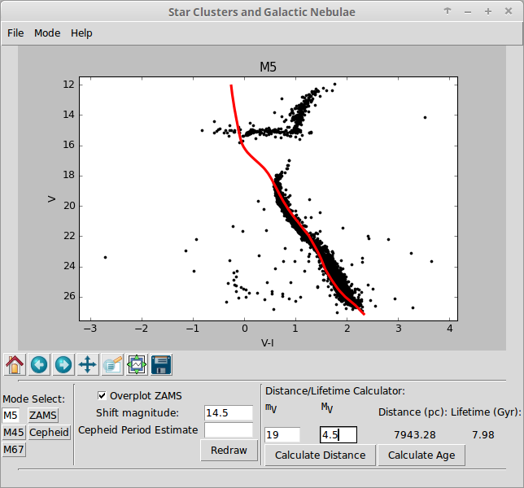

# Stellar Cluster Laboratory

Cornell astronomy lab on determining stellar cluster properties. Using color-magnitude diagrams of several known clusters, students fit the data using an interactive graphics user interface:

The laboratory worksheet for the Spring 2014 teaching of Astro 1103 (Nature of the Universe) is available [here](3_Cluster.pdf) along with the LaTeX source code so that you can modify at will. 
